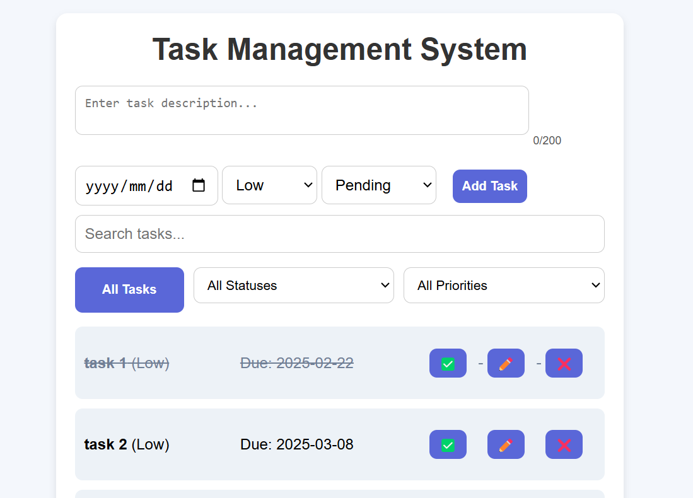

# Task Manager System 📋✅


A modern task management web application with persistent storage using localStorage. Manage your tasks with due dates, priorities, and status tracking.

 

## Features ✨

- **CRUD Operations**: Create, Read, Update, Delete tasks
- **Smart Validation**:
  - 200-character limit for descriptions
  - Past-date prevention for due dates
  - Required field indicators
- **Advanced Filtering**:
  - Dual dropdown filters (Status + Priority)
  - "All Tasks" reset functionality
- **Instant Search**: Find tasks by description or priority
- **Persistent Storage**: localStorage data persistence
- **Responsive Design**: Mobile-friendly interface
- **Visual Feedback**:
  - Success/error notifications
  - Character counter
  - Completed task styling

## Installation ⚙️

1. Clone repository:
```bash
git clone https://github.com/Trtheo/TaskManagerTQ.git

Open in VS CODE  or Command Line (cmd):

Create folder task_manager 
cd task_manager && do some operations for enhancement in VS CODE
```
2. How to run this Application
   - Open browser and type: 
   **goodtaskmanager.vercel.com**

## Usage 🖱️
 ### Adding Tasks
Enter description (200 characters max)

Select due date (future dates only)

Choose priority (Low/Medium/High)

Set status (Pending/Completed)

- Click "Add Task"

### Managing Tasks
Toggle Status: ✅ button

Edit: ✏️ button (with validation)

Delete: ❌ button

#### Filtering
Use dropdowns to filter by:

Status: All/Pending/Completed

Priority: All/Low/Medium/High

Click "All Tasks" to reset filters

#### Searching
Type in search bar to instantly filter tasks by:

Description content

Priority level

## Tech Stack 💻
- Frontend: JavaScript (ES6+)

- Storage: Browser localStorage

- Styling: Modern CSS Grid/Flexbox

- Markup: Semantic HTML5

## File Structure 📂

```bash
task-manager/
├── index.html
├── styles.css
└── script.js

```
## Contributing 🤝
Contributions welcome! Please:

- Fork the repository

- Create your feature branch

- Commit changes

- Push to the branch

- Open a Pull Request

**Thank you very much**

## Happy Coding!
